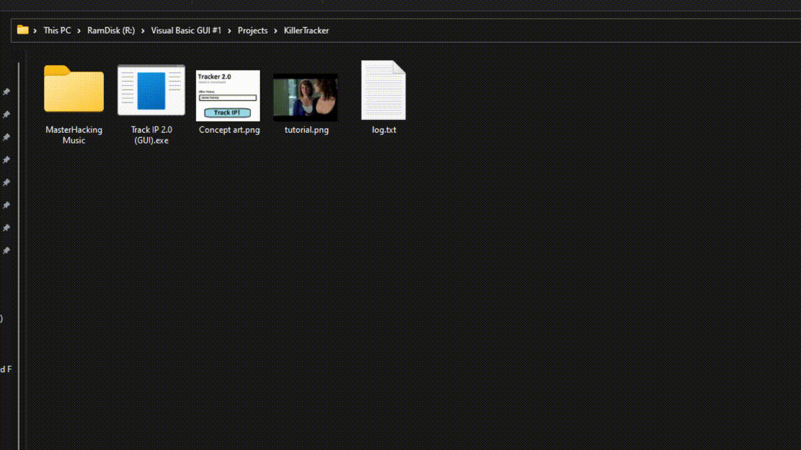
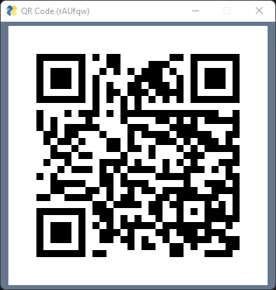
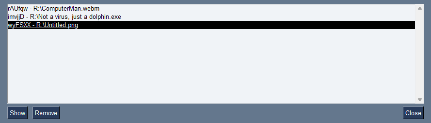

# QuickFileShare

A small python thingie to quickly share files on a LAN network.

‏‏‎ ‎


‏‏‎ ‎

**How to use:**

    1. [Clone](https://github.com/TriLinder/QuickFileShare/archive/refs/heads/main.zip) the project and extract the `.zip`

    2. Install the required modules from `requirements.txt`

    3. Configure the variables in `addFile.pyw`

```python
#-------------------#
ip = "127.68.13.12"
port = 6050
idLenght = 6
#-------------------#
```

    4. Run `sever.py` on system startup

    5. Done!  You should be now able to run `addFile.pyw` to share files

‏‏‎ ‎‏‏‎ ‎‏‏‎ ‎

**Running with arguments:**

`addFile.pyw` can be ran with a path argument to share files even quicker.

```shell
python addFile.pyw "R:/MasterHacking Music/001.mp3"
```

‎‎‎‏‏‎ ‎

**Adding to Windows Context menu:**




You should be able to add a QuickShare option to the Windows context menu by changing these registry keys:

```
[HKEY_CLASSES_ROOT\*\shell\QuickShare]
@="QuickShare"

[HKEY_CLASSES_ROOT\*\shell\QuickShare\command]
@="pyw C:\\Path\\To\\QuickFileShare\\addFile.pyw \"%1\""
```

‎‏‏‎ ‎

**Screenshots:**

‎‎‎‏‏‎ ‎

Choosing a file when run without arguments 


File share created


QR Code



Share list




